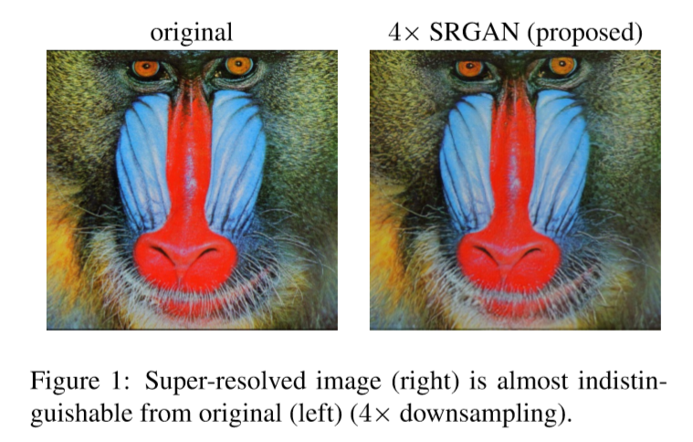

# SRGAN

Paper：Photo-Realistic Single Image Super-Resolution Using a Generative Adversarial Network

## 摘要：

>Despite the breakthroughs in accuracy and speed of single image super-resolution using faster and deeper convolutional neural networks, one central problem remains largely unsolved: how do we recover the **finer** texture details when we super-resolve at large upscaling factors? During image downsampling information is lost, making superresolution a highly **ill-posed** inverse problem with a large set of possible solutions. 

尽管更快和更多层的卷积神经网络在单张图像超分辨率重建的精度和速度上取得了突破，一个核心问题仍然没有解决：我们在对大量降采样后的图像进行超分辨率时该如何恢复更精细的纹理信息？图像降采样的信息丢失，让超分辨率成为了一个具有很多种可能结果的病态的逆向问题。

>The behavior of optimization based super-resolution methods is therefore **principally** driven by the choice of **objective function**. Recent work has largely focussed on minimizing the mean squared reconstruction error (**MSE**). The resulting **estimate**s have high peak signal-to-noise-ratio (**PSNR**), but they are often overly smoothed, lack high-frequency detail, making them perceptually unsatisfying. 

因此，超分辨方法的最优化主要是由目标函数的选择所决定。最近的研究很大一部分都着眼于将重建的均方误差（MSE）最小化，得到的结果具有很高的峰值信噪比（PSNR），但是通常过于平滑，缺少了高频信息，导致在视觉上效果不太尽如人意。

> In this paper, we present super resolution generative adversarial network (SRGAN). To our knowledge, it is the first framework **capable** of recovering photo-realistic natural images from 4× downsampling. To achieve this, we propose a perceptual loss function which consists of an adversarial loss and a content loss. The **adversarial** loss pushes our solution to the natural image manifold using a **discriminator** network that is trained to differentiate between the super-resolved images and original photo-realistic images.

在本文中，我们提出了超分辨率生成对抗网络（SRGAN）。据我们所知，这是第一种在4倍降采样后仍能恢复真实自然图像的框架。为了实现该效果，我们使用了一种感知损失函数，其包括对抗损失（adversarial loss）和内容损失（content less）。对抗损失使用鉴别网络（discriminator network）让我们的方法可以生成更加自然的图像，这种鉴别网络被训练来区分超分辨率图像和原始真实图像。

> In addition, we use a content loss function motivated by perceptual similarity instead of similarity in pixel space. Trained on 350K images using the perceptual loss function, our **deep residual network** was able to recover photo-realistic textures from heavily downsampled images on public benchmarks.

而且，我们使用感知相似性来激活内容损失，而不是使用像素空间相似性。使用35万张图像对感知损失函数进行训练后，我们的深度残差网络（ResNet）能够从在公共基准上进行大量降采样后的图像恢复出真实图像的纹理。
|               单词                |      含义      |
| :-------------------------------: | :------------: |
|               finer               |    更精细的    |
|             ill-posed             |     病态的     |
|        objective function         |    目标函数    |
|            principally            | 主要地、大部分 |
|     mean squared error (MSE)      |    均方误差    |
|             estimate              |   估计、评价   |
| peak signal-to-noise-ratio (PSNR) |   峰值信噪比   |
|            perceptual             | 知觉的、感知的 |
|              capable              |    有能力的    |
|            adversarial            |      对抗      |
|           discriminator           |     判别器     |
|             residual              |  剩余的、残差  |
|       deep residual network       |  深度残差网络  |

## 1、引言

>The highly challenging task of estimating a high resolution (HR), ideally perceptually superior image from its low-resolution (LR) counterpart is referred to as super-resolution(SR).  Despite the difficulty of the problem, research into SR received **substantial** attention from within the computer vision community. The wide range of applications [36] includes face recognition in **surveillance** videos [61], video streaming and medical applications. 

生成高分辨率图像是一项极具挑战性的任务，从低分辨率图像（LR）得到对应的高分辨率图像（HR）叫做超分辨率（SR）。尽管很难，SR的研究依然受到了计算机视觉界的大量关注，并广泛应用于监控视频或视频流中的面部识别和医疗领域。
|     单词     |          含义          |
| :----------: | :--------------------: |
| substantial  |         大量的         |
| surveillance |       监督、监视       |
|  ambiguity   | 含糊、不明确、模棱两可 |
|              |                        |
|              |                        |
|              |                        |
|              |                        |
|              |                        |
|              |                        |

> One major difficulty when estimating the HR image is the ambiguity of solutions to the underdetermined SR problem. Theill-posednatureoftheSRproblemisparticularly pronounced for high downsampling factors, for which texture detail in the reconstructed SR images is typically absent. Assumptions about the data have to be made to approximatetheHRimage,suchasexploitingimageredundancies or employing specifically trained feature models. 

生成高分辨率图像的一个主要困难是如何解决模糊区域的