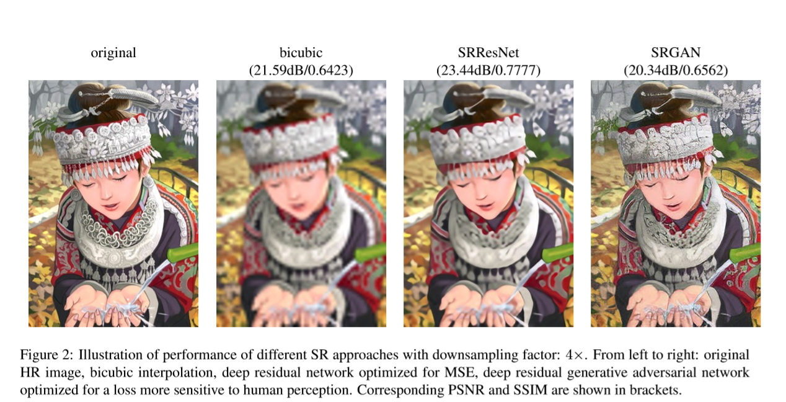
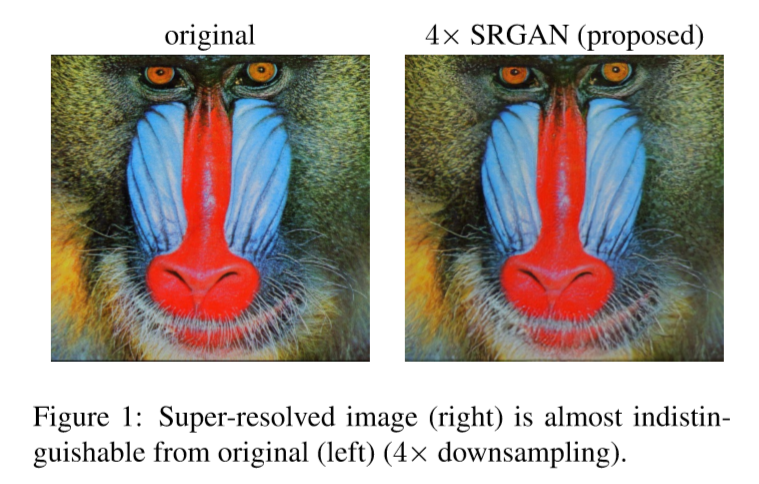

# **SRGAN**

Paper：Photo-Realistic Single Image Super-Resolution Using a Generative Adversarial Network

# 摘要：

>Despite the breakthroughs in accuracy and speed of single image super-resolution using faster and deeper convolutional neural networks, one central problem remains largely unsolved: how do we recover the **finer** texture details when we super-resolve at large upscaling factors? During image downsampling information is lost, making superresolution a highly **ill-posed** inverse problem with a large set of possible solutions. 

尽管更快和更多层的卷积神经网络在单张图像超分辨率重建的精度和速度上取得了突破，一个核心问题仍然没有解决：我们在对大量降采样后的图像进行超分辨率时该如何恢复更精细的纹理信息？图像降采样的信息丢失，让超分辨率成为了一个具有很多种可能结果的病态的逆向问题。

>The behavior of optimization based super-resolution methods is therefore **principally** driven by the choice of **objective function**. Recent work has largely focussed on minimizing the mean squared reconstruction error (**MSE**). The resulting **estimate**s have high peak signal-to-noise-ratio (**PSNR**), but they are often overly smoothed, lack high-frequency detail, making them perceptually unsatisfying. 

因此，超分辨方法的最优化主要是由目标函数的选择所决定。最近的研究很大一部分都着眼于将重建的均方误差（MSE）最小化，得到的结果具有很高的峰值信噪比（PSNR），但是通常过于平滑，缺少了高频信息，导致在视觉上效果不太尽如人意。

> In this paper, we present super resolution generative adversarial network (SRGAN). To our knowledge, it is the first framework **capable** of recovering photo-realistic natural images from 4× downsampling. To achieve this, we propose a perceptual loss function which consists of an adversarial loss and a content loss. The **adversarial** loss pushes our solution to the natural image **manifold** using a **discriminator** network that is trained to differentiate between the super-resolved images and original photo-realistic images.

在本文中，我们提出了超分辨率生成对抗网络（SRGAN）。据我们所知，这是第一种在4倍降采样后仍能恢复真实自然图像的框架。为了实现该效果，我们使用了一种感知损失函数，其包括对抗损失（adversarial loss）和内容损失（content less）。对抗损失使用鉴别网络（discriminator network）让我们的方法可以生成更加自然的图像流形，这种鉴别网络被训练来区分超分辨率图像和原始真实图像。

> In addition, we use a content loss function motivated by perceptual similarity instead of similarity in pixel space. Trained on 350K images using the perceptual loss function, our **deep residual network** was able to recover photo-realistic textures from heavily downsampled images on public benchmarks.

而且，我们使用感知相似性来激活内容损失，而不是使用像素空间相似性。使用35万张图像对感知损失函数进行训练后，我们的深度残差网络（ResNet）能够从在公共基准上进行大量降采样后的图像恢复出真实图像的纹理。

|               单词                |      含义      |
| :-------------------------------: | :------------: |
|               finer               |    更精细的    |
|             ill-posed             |     病态的     |
|        objective function         |    目标函数    |
|            principally            | 主要地、大部分 |
|     mean squared error (MSE)      |    均方误差    |
|             estimate              |   估计、评价   |
| peak signal-to-noise-ratio (PSNR) |   峰值信噪比   |
|            perceptual             | 知觉的、感知的 |
|              capable              |    有能力的    |
|            adversarial            |      对抗      |
|           discriminator           |     判别器     |
|             residual              |  剩余的、残差  |
|       deep residual network       |  深度残差网络  |
|             manifold              |      流形      |

# 1、引言

>The highly challenging task of estimating a high resolution (HR), ideally perceptually superior image from its low-resolution (LR) counterpart is referred to as super-resolution(SR).  Despite the difficulty of the problem, research into SR received **substantial** attention from within the computer vision community. The wide range of applications [36] includes face recognition in **surveillance** videos [61], video streaming and medical applications. 

生成高分辨率图像是一项极具挑战性的任务，从低分辨率图像（LR）得到对应的高分辨率图像（HR）叫做超分辨率（SR）。尽管很难，SR的研究依然受到了计算机视觉界的大量关注，并广泛应用于监控视频或视频流中的面部识别和医疗领域。

> One major difficulty when estimating the HR image is the **ambiguity** of solutions to the underdetermined SR problem. The ill-posed nature of the SR problem is particularly pronounced for high downsampling factors, for which texture detail in the reconstructed SR images is typically absent. Assumptions about the data have to be made to approximate the HR image, such as exploiting image **redundancies** or employing specifically trained feature models. 

生成高分辨率图像的一个主要困难是如何确定模糊区域的高分辨率内容。这种病态问题的特性尤其表现在大幅度降采样的图像上，他们的纹理细节在重建后的高分辨率图像中通常都会丢失。为了得到可能的高分辨率图像，必须要对数据进行假设，例如挖掘图像的冗余信息或者使用特别训练的特征模型。

>Over the last few decades substantial advances have been made in image SR [36, 53], with early methods based on **interpolation**, simple image features (e.g. edges) or statistical image **prior**s. Later **example-based** methods very successfully detected and exploited patch correspondences within a training database or calculated optimized dictionaries allowing for high-detail data representation. While of good accuracy, the involved optimization procedures for both patch detection and sparse coding are computationally intensive. More advanced methods **formulate** image-based SR as a **regression** problem that can be **tackle**d for example with Random Forests [39]. The recent rise of convolutional neural networks (CNNs) also had a substantial impact on image SR [8], not only improving the state of the art with respect to accuracy but also computational speed, enabling real-time SR for 2D video frames [40]. 

在过去的近几十年里，图像超分辨率领域有了巨大的进步，早期的一些方法是基于插值、简单的图像特征（例如边缘）或者统计图像的先验知识。后来基于样本的方法非常成功地在一个训练数据库或经过计算优化的字典中检测和利用各区块对应来获得更高精度的数据显示。但尽管精度很高，其中包含的优化过程对于区块检测和稀疏编码来说计算量都很大。更多先进的方法明确的把基于图片的超分辨率重建定义为例如可以被随机森林解决的回归问题。最近逐渐增多的卷积神经网络（CNNs）也在图像超分辨率上有着大量影响，提高了人们所期望的精度和计算速度，而且实现了对二维视频的实时超分辨率。

> The optimization target of supervised SR algorithms is usually the minimization of the mean squared error (MSE) between the recovered HR image and the ground truth. This is convenient as minimizing MSE also maximizes the peak signal to noise ratio (PSNR), which is a common measure used to evaluate and compare SR algorithms[53]. However, the ability of MSE(andPSNR) to capture perceptually relevant differences, such as high texture detail, is very limited as they are defined based on pixel-wise image differences [52, 49, 21]. This is illustrated in Figure 2, where highest PSNR does not necessarily reflect the perceptually better SR result. 

监督超分辨率理论的优化目标通常是最小化恢复得到的高分辨率图像和真实图像之间的均方差（MSE）。最小化均方差的同时最大化峰值信号比（PSNR）很方便，峰值信号比是一种常用的评估和对比超分辨率方法的方式。然而，MSE和PSNR捕捉感知相关的差异（例如高质感的细节）能力非常局限，因为他们是基于像素差异定义的。如图二所示，最大的PSNR不一定就是感官上最高的超分辨率结果。

> The perceptual difference between the super-resolved images and original images means that the super-resolved images are not photo-realistic as defined by Ferwerda [12]. Photo-realistic image super-resolution techniques including [44, 60, 57] have been focusing on minimizing the perceptual differences by using detail **synthesis**, a multi-scale dictionary or a structure aware loss function. 

超分辨率图像和原始图像感官上的不同意味着生成的图像不够真实（Ferwerda 的定义）。包括[44,60,57]在内的能够生成真实图像的超分辨率技术一直致力于通过使用细节合成、多尺度字典或结构感知损失函数来最小化感知差异。

> In this work we propose super-resolution generative adversarial network(SRGAN) for which we employ a deep residual network and **diverge** from MSE as the **sole** optimization target. Different from previous works, we define a **novel** perceptual loss using high-level feature maps of the VGG network [41, 26] combined with a discriminator that encourages solutions perceptually hard to distinguish from the HR reference images. An example of a photo-realistic image that was super-resolved from a 4× downsampling factor using SRGAN is shown in Figure 1. 

本文中我们提出的超分辨率生成对抗网络使用了深度残差网络，并把MSE偏离作为唯一的优化目标。和以前的方法不同，我们使用VGG网络的高级特征图结合鉴别器定义了一个新的感知损失，来鼓励生成的图像在视觉上难以与高分辨率图像区分。图1是一个从4倍降采样使用SRGAN恢复出来真实图像的例子。

|          单词           |              含义              |
| :---------------------: | :----------------------------: |
|       substantial       |             大量的             |
|      surveillance       |           监督、监视           |
|        ambiguity        |     含糊、不明确、模棱两可     |
| redundancy = redundance |              冗余              |
|      interpolation      |           插入、插值           |
|          prior          | （时间、顺序等）先前的；优先的 |
|      example-based      |           基于样本的           |
|         tackle          |           应付、处理           |
|        formulate        |  规划、用公式表示、明确地表达  |
|       regression        |           回归、退化           |
|        synthesis        |              合成              |
|         diverge         |           分叉、偏离           |
|          sole           |         单独的、唯一的         |
|          novel          |         新奇的、异常的         |

## 1.1相关研究

### 1.1.1图像超分辨率

>There is a vast amount of literature and research that focuses on the problem of recovering high-resolution images from a low-resolution observation. Recent overview articles include Nasrollahi and Moeslund [36] or Yang et al. [53]. Here we will focus on single image super-resolution(SISR) and will not further discuss approaches that recover HR images from multiple images, such as object images acquired from varying view points or **temporal sequence**s of **image frame**s [4, 11]. 

有大量的文献和研究致力于从低分辨率影像恢复高分辨率影像。近期的综述文章包括Nasrollahi 、Moeslund 或Yang 等人。在这里我们将着眼于单张图像超分辨率（SISR），并且不会深入讨论从多张图片中恢复出高分辨率图像的方法，例如从不同的视点或图像帧的时间序列获取的目标图像。

> Prediction-based methods are among the first and more **straightforward** methods to tackle SISR. While these **filtering** approaches, e.g. linear, **bicubic** or **Lanczos** [10] filtering, can be very fast, they oversimplify the SISR problem and usually **yield** overly smooth solutions failing to recover the high-frequency image information. **Interpolation** methods that put particular focus on edge-preservation have been proposed in for example Allebach and Wong [1] or Li et al. [32].

基于预测的方法是解决单图像超分辨率的第一个也是最直接的方法。虽然这些滤波方法，例如线性、双三次或兰索斯滤波，速度非常快，但是过度简化了单图像超分辨率问题，并且通常生成过度平滑的结果并且无法恢复出图像的高频信息。插值方法通常特别注意边缘信息的保护，例如Allebach和Wong或者Li等人所提出的。

> More powerful approaches aim to establish a complex mapping between low- and high-resolution image information and usually rely on training data. 

很多厉害的致力于在低分辨率和高分辨率影像之间建立复杂映射的方法通常依赖于训练数据。

> Many methods that are based on example-pairs rely on LR training patches for which the corresponding HR counterparts are known. Early work was presented by Freeman et al. [14, 13]. Related approaches to the SR problem **originate** in compressed sensing and aim to estimate a sparse patch representation with respect to an over-complete dictionary [54, 9, 59]. In Glasner et al. [17] the authors exploit patch redundancies across scales within the image to drive the SR. This **paradigm** of self-similarity is also employed in Huang et al. [24], where insufficiently descriptive self dictionaries are extended by further allowing for small transformations and shape variations.

很多基于样本匹配的方法依赖于低分辨率的训练，而且对应的高分辨率区块已知。早期的工作是由Freeman等人提出的。SR问题的相关方法起源于压缩感知，目的是利用完备的字典来估计稀疏表示。在Glasner 等人提出的论文中，作者利用图像中跨尺度的区块冗余来实现超分辨率。这种自相关性的典范也被用于Huang等人的文章中，描述不充分的字典被小的转换和形状变化所扩展。

> To reconstruct realistic texture detail while avoiding edge **artifact**s, Tai et al. [44] combine an edge-directed SR algorithm based on a **gradient** **profile** prior [42] with the benefits of learning-based detail synthesis. Zhang et al. [60] propose a multi-scale dictionary to capture redundancies of similar image patches at different scales with the goal to enhance visual details. To **super-resolve** landmark images, Yue et al. [57] **retrieve** correlating HR images with similar content from the web and propose a structure-aware matching **criterion** for **alignment**. 

为了重建出真实的纹理细节并且避免人造边缘信息，Tai等人把基于梯度剖面先验知识的边缘导向SR方法和基于学习的细节合成方法的优点结合了起来。Zhang等人提出了一种多尺度的字典来捕捉相似图像对在不同尺度的多余信息，希望能够提高视觉细节。为了超分辨率地标图像，Yue等人使用网络上的相似内容来恢复对应的高分辨率图像信息，并且提出了一种基于结构感知的对齐匹配标准。

> Neighborhood **embed**ding approaches upsample a given LR image patch by finding similar LR training patches in a low dimensional manifold and combining their corresponding HR patches for reconstruction [45, 46]. In Kim and Kwon [28] the authors **emphasize** the tendency of neighborhood approaches to overfit and learn a more general map from low to high-resolution images from example pairs using **kernel ridge regression**. 

邻域插值方法针对给定低分辨率影像在低维流形中寻找相似的低分训练区块并结合他们对应的高分区块来实现重建。在Kim和Kwon的文章中，作者强调了邻域插值方法过拟合和在样本对中使用核岭回归从低分到高分图像学习的映射过于宽泛的问题。

> The regression problem can also be solved directly with Random Forests and thus the explicit training of a sparse dictionary is avoided[39]. In Daietal. [5] the authors learn a multitude of patch-specific **regressor**s during training and select the most appropriate regressors for a given LR patch during testing using kNN. 

这种回归问题能够被随机森林直接解决，训练稀疏字典也可以避免。在Daietal的文章中，作者在训练中学习了大量特定区块的回归量，并在使用kNN测试时为给定的LR区块选择了最合适的回归量。

> Recently CNN based SR algorithms have shown excellent performance. In Wang et al. [50] the authors encode a sparse representation prior into their **feed-forward** network architecture based on the learned **iterative** **shrinkage** and **threshold**ing algorithm (LISTA) [19]. Dong et al. [7, 8] used bicubic interpolation to upscale an input image and trained a three layer deep fully convolutional network end to-end to achieve state of the art SR performance.

最近基于CNN的超分辨率方法表现很出色。在Wang等人的文章中，作者在他们基于学习迭代收缩和阈值算法的前馈网络结构中编码了一种先验稀疏表示。Dong等人使用双三次插值来上采样输入图像，并训练了一个端对端的三层深度全卷积网络来实现最优秀的超分辨率效果。

> **Subsequently**, it was shown that enabling the network to learn the **upscaling** filters directly can further increase performance both in terms of accuracy and speed [40, 48]. In Shi et al. [40] the upscaling is only performed in the last layer of the network avoiding expensive computations in the high-resolution space of the SR image. With their deeply **recursive** convolutional network (DRCN), Kim et al. [27] presented a highly performant architecture that allows for long-range pixel dependencies while keeping the number of model parameters small. Of particular relevance in the context of our paper is the work by Johnson et al. [26], who rely on a loss function closer to perceptual similarity to recover visually more convincing HR images.

后来结果表明，使网络能够直接学习放大滤波器可以在精度和速度方面进一步提高性能。在Shi等人的论文中，放大滤波器只在网络的最后一层有用，可以避免超分辨率过程中高分辨率空间的大量计算。在深度递归卷积网络（DRCN）中，Kim等人提出了一种高性能的结构，可以保证少量模型参数的同时具有广泛的像素相关性。在Johnson等人的论文中，

|          单词           |          含义          |
| :---------------------: | :--------------------: |
|        temporal         |     暂时的、当时的     |
|    temporal sequence    |        时间序列        |
|       image frame       |         图像帧         |
|     straightforward     | 简单的、明确的、坦率的 |
|        filtering         |          滤波          |
|         bicubic         |        双三次的        |
|         Lanczos         |         兰索斯         |
|          yield          |       产出、出产       |
|      Interpolation      |          插值          |
|        originate        |    引起、创作、发源    |
|        paradigm         |          范例          |
|        artifact         |        人工产品        |
|        gradient         |          梯度          |
|         profile         |          轮廓          |
|      super-resolve      |        超分辨率        |
|        retrieve         |       检索、恢复       |
|        criterion        |          标准          |
|        alignment        |       队列、对齐       |
|          embed          |      嵌入、使插入      |
|        emphasize        |       着重、强调       |
| kernel ridge regression |        核岭回归        |
|        regressor        |         回归量         |
|      feed-forward       |          前馈          |
|        iterative        |     迭代的、反复的     |
|        shrinkage        |       收缩、减低       |
|        threshold        |       门槛、阈值       |
|      subsequently       |       随后、后来       |
|         upscale         |       放大、提高       |
|        recursive        |     递归的、循环的     |

